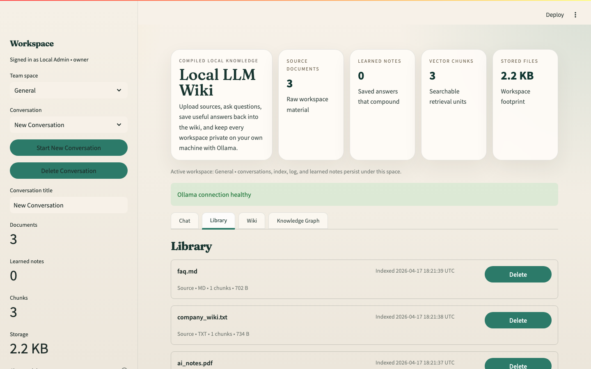
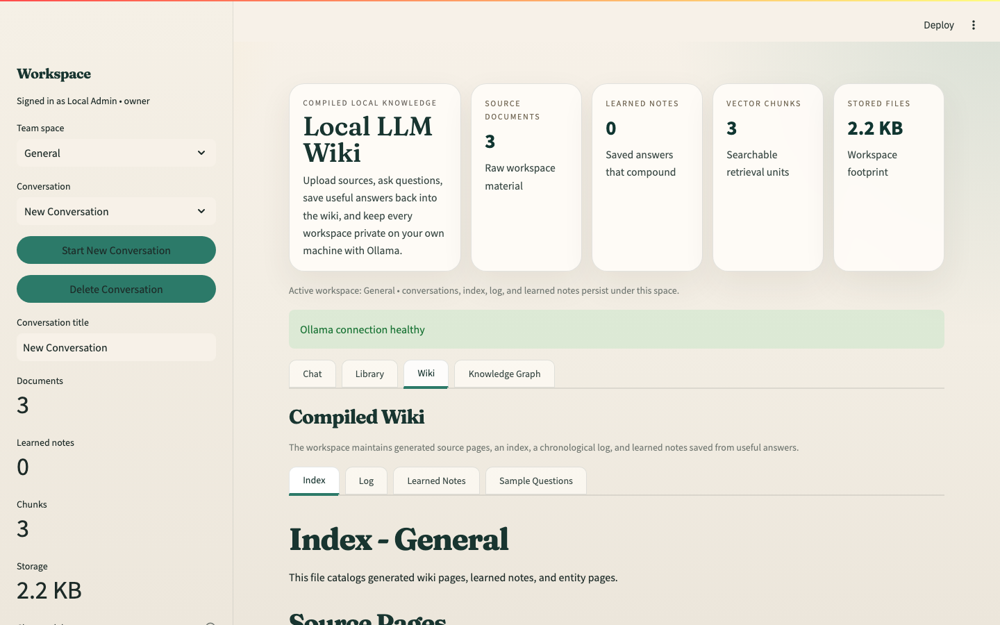
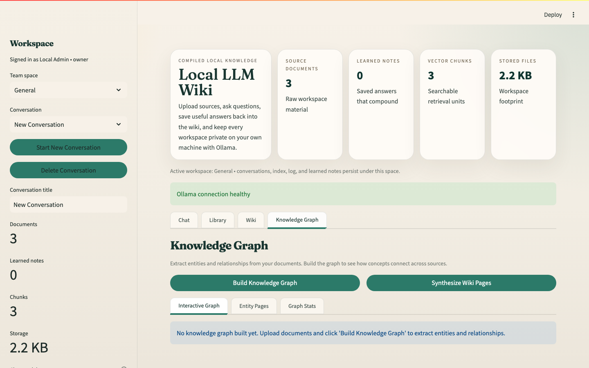
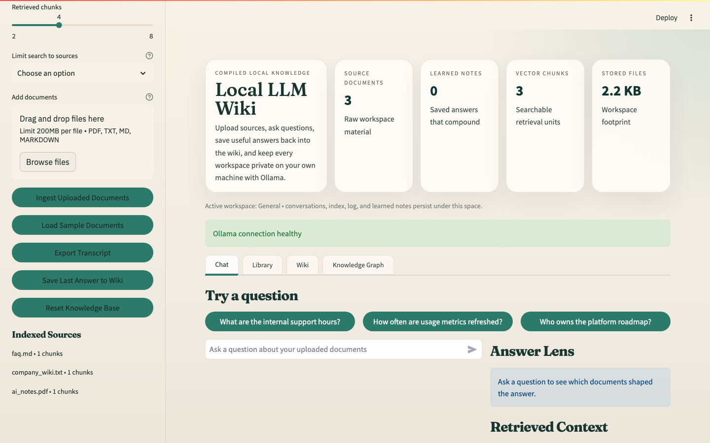
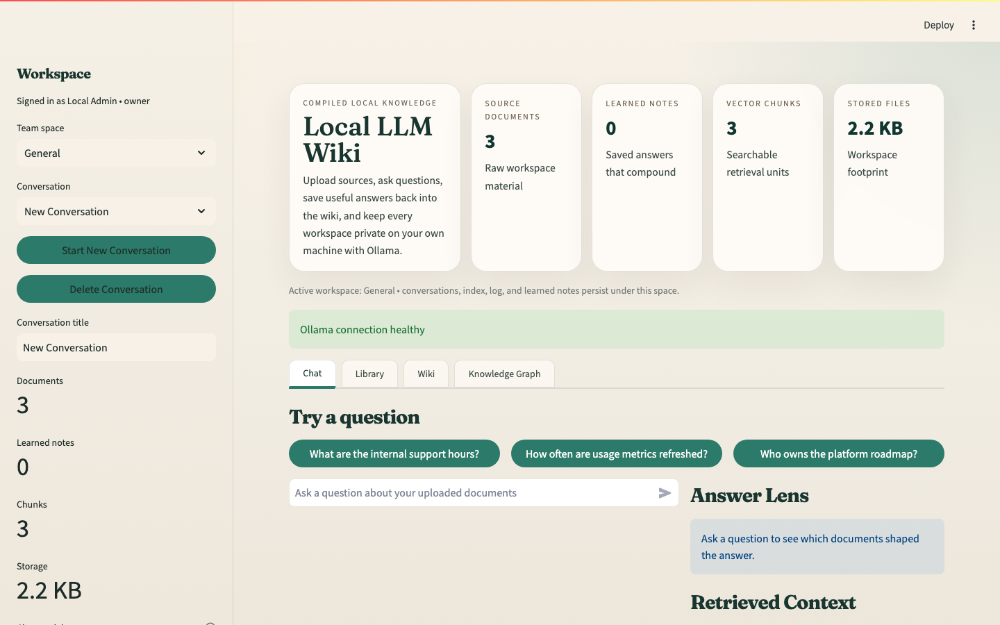
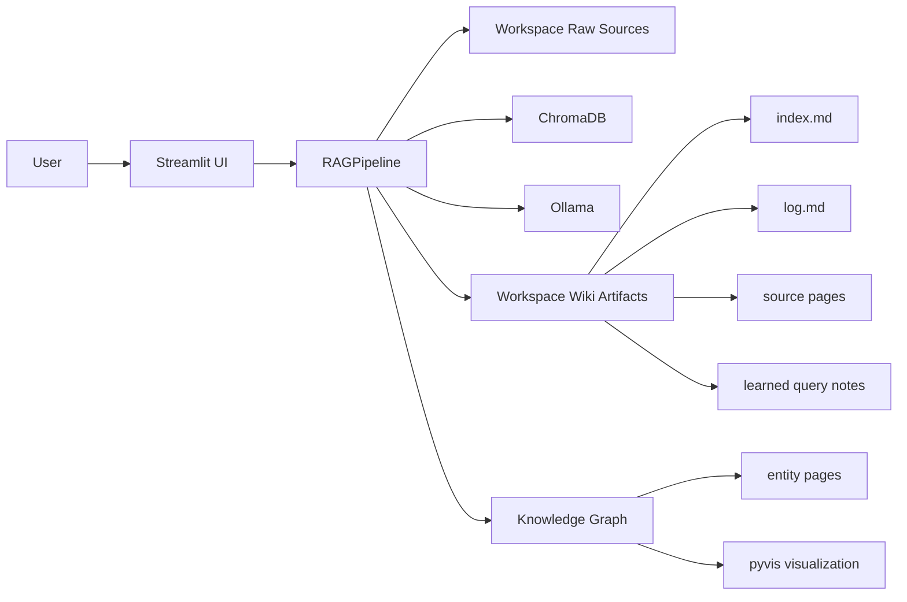

# Local LLM Wiki

Local LLM Wiki is a production-oriented, local-first knowledge assistant for teams and individuals. It uses Streamlit for the interface, Ollama for local LLM inference, and ChromaDB for persistent retrieval. You can upload documents, ask grounded questions, save useful answers back into the wiki, and keep everything on your machine.

This repository now goes beyond a basic upload-and-chat demo. It implements a practical local LLM wiki workflow with:

- workspace isolation
- persistent conversations
- source summary pages
- `index.md` and `log.md` generation
- transcript export
- answer-to-wiki learning
- inline evidence citations
- optional local authentication

## Screenshots

### Chat — Ask questions with inline citations

Upload documents, ask grounded questions, and get streamed answers with source citations. The retrieved context panel shows exactly which chunks were used and their relevance scores.


### Library — Manage sources and learned notes

Browse all ingested documents and saved wiki notes. Upload new files or remove outdated sources without leaving the app.



### Wiki — Compiled knowledge base

Explore auto-generated source summaries, the workspace index, activity log, and any answers you saved back into the wiki.



### Knowledge Graph — Entity relationships across documents

Visualize entities (people, teams, tools, policies, concepts) and their relationships extracted from your entire corpus. Click nodes to explore connections.



### Save to Wiki — Compounding knowledge loop

Save a useful answer as a learned note. It gets re-ingested into retrieval so the system gets smarter over time.



### Workspace Isolation — Separate knowledge spaces

Each workspace maintains its own documents, conversations, wiki artifacts, and knowledge graph — fully isolated from other workspaces.



## Primary Use Case

The main use case this app is built around is a team handbook or internal wiki assistant:

1. Upload policies, onboarding guides, FAQs, release notes, and operational docs.
2. Ask conversational questions across that content.
3. Inspect the evidence used for each answer.
4. Save especially useful answers back into the wiki as durable learned notes.
5. Reuse those learned notes in future retrieval.

The same flow also works well for a personal second brain.

## What Was Implemented From The Referenced Projects

The requested references were reviewed and their strongest concepts were incorporated where they fit a local Streamlit + Ollama stack.

### Karpathy gist

Implemented concepts:

- compiled wiki mindset instead of raw one-shot RAG only
- persistent wiki artifacts per workspace
- `index.md` and `log.md`
- saving valuable query outcomes back into the knowledge base

### nashsu/llm_wiki

Implemented concepts:

- product-style workspace UX
- persistent multi-conversation behavior
- save-to-wiki compounding workflow
- stronger provenance and operational controls

### lucasastorian/llmwiki

Implemented concepts:

- clear separation of UI, retrieval, and wiki state management
- citation-aware answer generation
- durable per-workspace storage model

### NicholasSpisak/second-brain

Implemented concepts:

- second-brain style workspace structure
- source pages plus index and log
- stronger onboarding and sample-question guidance
- local knowledge maintenance workflow

More detail is documented in [docs/INSPIRATION.md](docs/INSPIRATION.md).

## Features

### Core retrieval

- PDF, TXT, and Markdown ingestion
- Ollama-based embeddings by default
- Persistent ChromaDB vector storage
- Source filtering and top-k retrieval controls
- Lightweight reranking using semantic score plus lexical overlap
- Inline citation prompting such as `[company_wiki.txt#chunk-0]`

### Compiled wiki behavior

- Per-workspace source summary pages under `wiki/sources/`
- Auto-maintained `wiki/index.md`
- Auto-maintained `wiki/log.md`
- Learned notes under `wiki/queries/`
- Save-last-answer flow that re-ingests useful answers into the retrieval layer

### Knowledge graph and wiki synthesis

- LLM-powered entity and relationship extraction from all ingested documents
- Interactive graph visualization using pyvis (persons, teams, tools, processes, policies, concepts)
- Cross-document entity detection — see which concepts span multiple sources
- Wiki-page synthesis pass that generates rich, structured articles from source content
- Auto-generated entity pages stored under `wiki/graph/entities/`
- Graph statistics dashboard with entity type breakdown

### User experience

- Streamed answers from Ollama
- Persistent conversations stored per workspace
- Conversation switching and deletion
- Transcript export to Markdown
- Retrieved context inspection with relevance bars
- Purpose-built sample prompts in the UI
- Library view for source and learned-note management

### Operations and access

- Workspace isolation for team or project spaces
- Optional local username/password login
- Config-driven runtime
- Docker support
- Automated tests and real smoke test

## Architecture



### Runtime flow

1. A user signs in optionally and chooses a workspace.
2. Source documents are stored under the workspace raw folder.
3. Documents are chunked, embedded, and indexed into Chroma.
4. A source summary page is written into the workspace wiki.
5. `index.md` and `log.md` are updated.
6. Queries retrieve chunks and stream an Ollama answer with citations.
7. A useful answer can be saved back into the wiki as a learned note.
8. That learned note is re-ingested so the knowledge base compounds.
9. The knowledge graph extracts entities and relationships across all sources.
10. Entity pages and an interactive visualization are generated from the graph.

## Project Structure

```text
llm-wiki/
├── app.py                  # Streamlit entrypoint and UI
├── rag_pipeline.py         # Core RAG, wiki, and knowledge graph orchestration
├── knowledge_graph.py      # Entity extraction, graph storage, pyvis rendering
├── ollama_client.py        # Ollama API client
├── auth.py                 # Optional local authentication
├── chroma_telemetry.py     # ChromaDB telemetry suppression
├── utils.py                # Shared utilities
├── config.yaml             # Runtime configuration
├── requirements.txt
├── Dockerfile
├── smoke_test.py           # End-to-end test against real Ollama
├── LICENSE
├── .gitignore
├── .dockerignore
├── sample_docs/
│   ├── company_wiki.txt
│   ├── ai_notes.pdf
│   └── faq.md
├── tests/
│   ├── test_rag_pipeline.py
│   └── test_utils.py
└── docs/
    ├── screenshots/          # App screenshots for README
    ├── INSPIRATION.md
    ├── OPERATIONS.md
    └── SAMPLE_QUESTIONS.md
```

## Workspace Layout

Each workspace is stored locally under:

```text
data/workspaces/<workspace-slug>/
├── raw/sources/
├── chroma/
├── wiki/
│   ├── index.md
│   ├── log.md
│   ├── sources/
│   ├── queries/
│   └── graph/
│       ├── graph.json
│       └── entities/
├── exports/
└── .llm-wiki/chats/
```

## Prerequisites

- Python 3.11 or newer
- Ollama installed locally
- At least one local Ollama model such as `llama3:latest`

Useful commands:

```bash
ollama serve
ollama pull llama3:latest
```

The default setup uses Ollama for both embeddings and answer generation, which keeps the app fully local and avoids extra model downloads.

If you want sentence-transformers embeddings instead, install them manually and switch `embeddings.provider` in [config.yaml](config.yaml).

## Setup

### 1. Create a virtual environment

```bash
python -m venv .venv
source .venv/bin/activate
```

### 2. Install dependencies

```bash
pip install -r requirements.txt
```

### 3. Start Ollama

```bash
ollama serve
```

### 4. Pull a chat model if needed

```bash
ollama pull llama3:latest
```

### 5. Run the app

```bash
streamlit run app.py
```

Open the Streamlit URL, usually `http://localhost:8501`.

## End-to-End Demo

The fastest way to validate the app locally:

1. Start the app.
2. Click `Load Sample Documents`.
3. Ask `What are the internal support hours?`
4. Inspect the `Retrieved Context` panel.
5. Click `Save Last Answer to Wiki`.
6. Open the `Wiki` tab and confirm a learned note was created.
7. Export the conversation with `Export Transcript`.

This exercises ingestion, retrieval, streaming answer generation, citations, transcript export, and automated learning.

## Sample Questions

You asked for explicit sample questions to test with. Start with these:

- What are the internal support hours?
- How often are usage metrics refreshed?
- Who owns the platform roadmap?
- What security guidelines should employees follow?
- Explain retrieval augmented generation in simple terms.

Cross-document prompts:

- Compare the company wiki guidance with the FAQ scheduling details.
- Which sample files should a new operations team member read first?
- What parts of the sample knowledge base reflect policy versus conceptual notes?

More examples are in [docs/SAMPLE_QUESTIONS.md](docs/SAMPLE_QUESTIONS.md).

## Automated Learning Components

You specifically asked where the automated learning is. In this implementation it consists of four concrete pieces:

- Source summaries: each uploaded source creates a persistent page under `wiki/sources/`.
- Workspace index: `wiki/index.md` is regenerated so the compiled wiki stays browsable.
- Workspace log: `wiki/log.md` records ingests, queries, exports, and learning events.
- Save-to-wiki loop: useful answers can be stored as learned notes under `wiki/queries/` and are automatically re-ingested for future retrieval.

That gives the app a compounding behavior rather than forcing it to rediscover everything from raw documents every time.

## Optional Local Authentication

Authentication support is implemented but disabled by default in [config.yaml](config.yaml) so local setup stays simple.

To enable it:

1. Set `security.enabled: true`.
2. Replace the sample hash with your own password hash.
3. Adjust the allowed workspace list per user.

Generate a SHA256 password hash with:

```bash
python -c "import hashlib; print(hashlib.sha256(b'your-password').hexdigest())"
```

## Configuration

Key config sections in [config.yaml](config.yaml):

- `ollama.*`: server URL, model, timeout, temperature
- `embeddings.*`: embedding provider and model
- `retrieval.top_k`: default retrieval depth
- `workspaces.defaults`: available local workspaces
- `security.*`: optional local login
- `paths.workspace_root`: root storage folder for all workspace state
- `prompts.system_prompt`: answer formatting and citation behavior

## Docker

Build:

```bash
docker build -t llm-wiki .
```

Run:

```bash
docker run --rm -p 8501:8501 \
  -v $(pwd)/data:/app/data \
  -e OLLAMA_BASE_URL=http://host.docker.internal:11434 \
  llm-wiki
```

Notes:

- On macOS, `host.docker.internal` is usually the easiest way to reach Ollama from the container.
- Mount `/app/data` so workspaces, conversations, and wiki artifacts persist.
- If you enable login, keep [config.yaml](config.yaml) controlled and avoid using the sample hash in shared environments.

## Testing

Automated tests:

```bash
pytest
```

Real smoke test against local Ollama:

```bash
python smoke_test.py
```

The smoke test now validates:

- workspace-scoped ingest
- real Ollama answer generation
- evidence retrieval
- save-to-wiki learned note creation

## Verified Status

This repository was validated locally with:

- `pytest` passing
- `python smoke_test.py` passing against `llama3:latest`
- Streamlit booting successfully and serving its health endpoint in the earlier validation pass

## Production Notes

- Keep `data/workspaces/` on persistent storage.
- Do not commit populated workspace data.
- Put Streamlit behind a reverse proxy and network controls if you expose it outside localhost.
- Replace the sample auth hash before enabling login for real users.
- For larger corpora, tune chunking and retrieval before increasing model size.
- Chroma currently emits library-side deprecation warnings under pytest; these come from the dependency, not from the application code.

## Additional Documentation

- [docs/INSPIRATION.md](docs/INSPIRATION.md)
- [docs/OPERATIONS.md](docs/OPERATIONS.md)
- [docs/SAMPLE_QUESTIONS.md](docs/SAMPLE_QUESTIONS.md)
